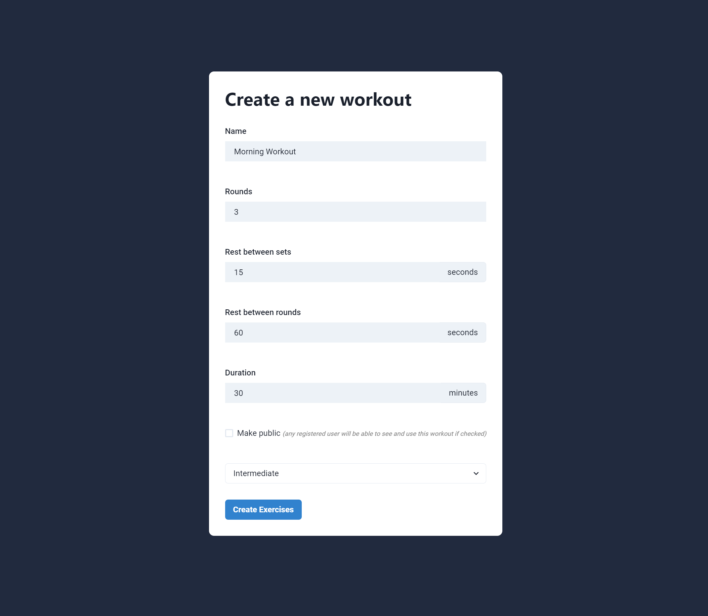
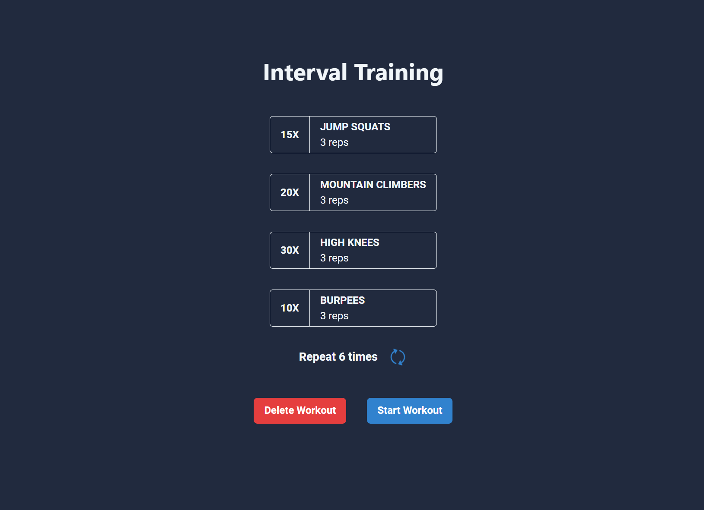
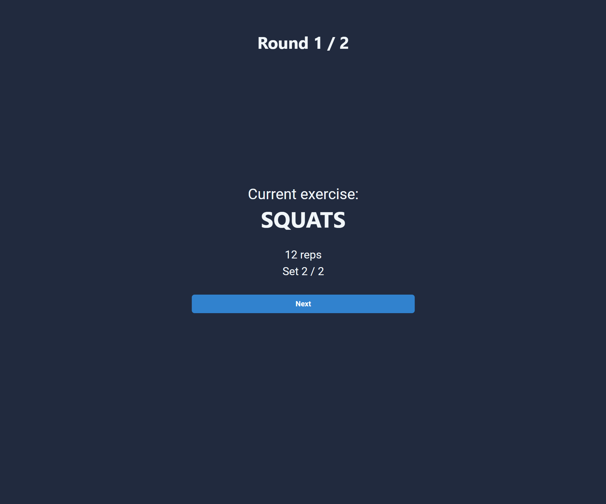

# WorkoutPal

With Workout Pal, users can create and share their personalized workout routines. The app guides you through a chosen workout, providing precise instructions for each exercise.

## Technologies Used

- **Frontend**: React.js, Chakra-UI
- **Backend**: Express.js
- **Database**: MongoDB

## Key Features

### Account Management and Authentication

WorkoutPal simplifies account management, allowing users to effortlessly create, update, and delete accounts. Authentication is secured through the use of Json Web Tokens.

### Create a Workout

Under the Create Workout section, you will be asked to fill a form and provide information about a new workout. Each workout consists of multiple exercises, which you can add in the next step. Give your workout a name, a number of rounds (how many times the circuit of all exercises is repeated), amount of seconds to rest between each set of an exercise, and amount of rest between rounds of a workout. 

The workout can be flagged as public, if you want to share it with other users, or you can keep it private and only visible to you.

Choose the difficulty of the workout and click Create Exercises.

Add your first exercise to the workout you just created. Sets define how many times the exercise will be repeated before continuing to the next exercise in the workout, and reps define a number of repetitions of the exercise. In our case, we will do three sets of pushups, each set consisting of 10 pushups.

When you're done adding exercises to the workout, you can view the workout before submitting it.

### Explore Workouts

The workout you just added will be visible in the My Workouts section. If you've made it public, you'll be able to search for it in Explore Workouts.

### Run a Workout

Clicking on a workout will display an overview of the workout, the exercises, sets, reps and number of repetitions. 

When you're ready to sweat, click Start Workout and the app will track the workout and tell you exactly which exercise to do, when and how long to rest, and which execrise is coming up. All you have to do is click Next after you've finished the current exercise and follow the instructions.

## Try It Out
[Test the app here](https://workout-pal-af.netlify.app/). Demo user credentials are provided for testing purposes. In the Explore Workouts sections, you can find a Test Workout, which is intentionally kept short, to demonstrate the functionality of the app.